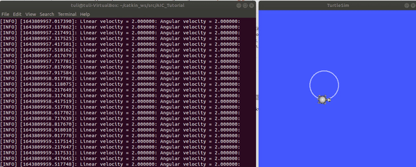

# Getting-fast-into-ROS

In robot programming, implementing planning processes that is customized into the specific application is very essential. In this regard, ROS has a big advantage to control robot with user defined process plans. However, it is not easy to find a precise tutorial that helps to devive into ROS in short time. 

Let us consider a turtle sim, 2D robot and dive fast into ROS. Assuming you have a complete installation of ROS packages,and turtle sim; 

## Content
  * [Explained tutorial using Command terminal with Turtle simulation](#explained-tutorial-using-command-terminal-with-turtle-simulation)
  * [Explained tutorial with Python script](#explained-tutorial-with-python-script)
    + [Subscriber function](#subscriber-function)
    + [Publisher function](#publisher-function)
    + [How to run the script](#how-to-run-the-script)


## Explained tutorial using Command terminal with Turtle simulation
This tutorial helps to get familiar with ROS environment using Turtle sim using command line.

+ Open terminal command and run;
```
$ rosrun turtlesim turtlesim_node
```
+ If you want check rostopic lists using 
```
$ rostopic list
```
> *Output*;
```
 /turtle1/cmd_vel
 /turtle1/color_sensor
 /turtle1/pose 
```

+ To control the turtle movement with your keyboard, 
```
$ rosrun turtlesim turtle_teleop_key
```

+ To subscribe / display the message data in the rostopic, e.g.,cmd_vel ;

```
$ rostopic echo /turtle1/cmd_vel
```
+ To know the types of the topic
```
$ rostopic info /turtle1/cmd_vel
```
> *Output*;
```
Type: geometry_msgs/Twist

Publishers: None

Subscribers: 
 * /rostopic_7099_1643797240683 (http://xxx:36929/)
 * /turtlesim (http://xxx:38021/)
```

+ To show types of messages, 
```
rosmsg show geometry_msgs/Twist
```
> *Output*;
```
geometry_msgs/Vector3 linear
  float64 x
  float64 y
  float64 z
geometry_msgs/Vector3 angular
  float64 x
  float64 y
  float64 z
```
+ If you want to publish message to rostopic node, e.g., Twist, change the desired parameter value and run ;
```
$ rostopic pub turtle1/cmd_vel geometry_msgs/Twist "linear:
  x: 2.0
  y: 0.0
  z: 0.0
angular:
  x: 0.0
  y: 0.0
  z: 3.0" 
```

## Explained tutorial with Python script

### Subscriber function
Save the Subscriber function as "*subscriber_tutorial.py*" in your src folder in catkin_ws.
```python
import sys
import rospy
from geometry_msgs.msg import Twist
import datetime

def callback_pose(data):
    """Get the ROS message"""   
    print(data)


def listener():
   """Subscribe to ROS topic node"""

    rospy.init_node('listener', anonymous=True)
    rospy.Subscriber("/turtle1/cmd_vel", Twist, callback_pose)
    rospy.spin()

if __name__ == '__main__':
    listener()
```    
### Publisher function
Save the publisher function as "*publisher_tutorial.py*" in your src folder in catkin_ws.
```python
import rospy
from geometry_msgs.msg import Twist
import sys

def moveFunction_turtle(linear_velocity, angular_velocity):
    """Move turtle robot with input velocity"""
    rospy.init_node('moveFunction_turtle', anonymous=True)
    pub = rospy.Publisher("/turtle1/cmd_vel", Twist, queue_size=10)
    rate = rospy.Rate(10) # 10hz
    velocity = Twist()
    while not rospy.is_shutdown():
	velocity.linear.x = linear_velocity
	velocity.angular.z = angular_velocity

        rospy.loginfo("Linear velocity = %f: Angular velocity = %f: ", linear_velocity, angular_velocity)
        pub.publish(velocity)
        rate.sleep()


if __name__ == '__main__':
    try:
        moveFunction_turtle(float(sys.argv[1]), float(sys.argv[2]))
    except rospy.ROSInterruptException:
        pass
```
### How to run the script
Open new terminal and change the directory to the *publisher* and *subscriber* function containing folder and run the functions separately as follows;
```
python publisher_tutorial.py 2.0 4.0
```
Or 

```
python subscriber_tutorial.py
```



Congratulations, now you are able to subscribe and publish to rostopic node!!
